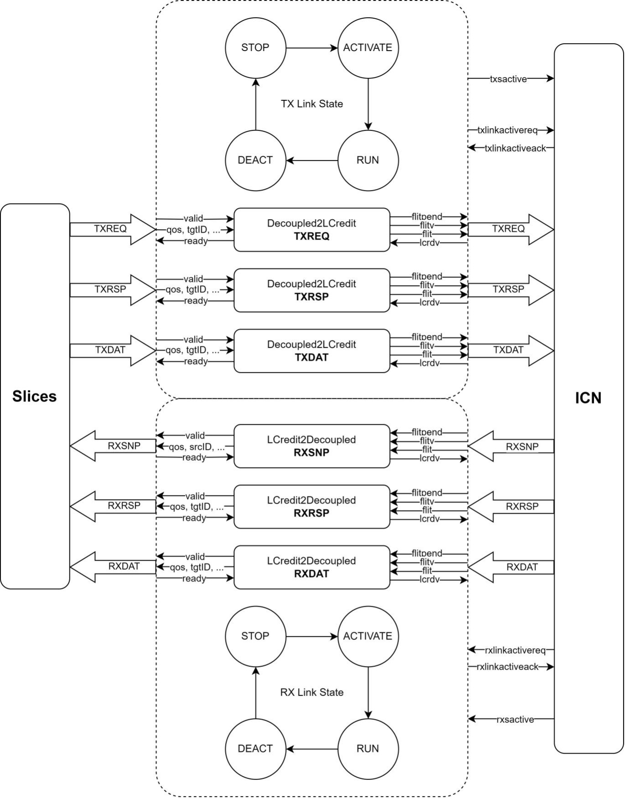

# 链路层控制器 LinkMonitor

## 文档概述
本文档描述LinkMonitor的功能，LinkMonitor是一个用于转换握手并维护Link的功耗。本文档根据功能给出测试点参考，方便测试的参与者理解测试需求，编写相关测试用例。本文当对应的RTL代码位于CoupledL2/src/main/scala/coupledL2/tl2chi/chi/LinkLayer.scala

## 术语说明

| 名称 | 定义 |
|------|------|
| CHI (Coherent Hub Interface) | ARM定义的总线协议，用于多核间的一致性通信 |
| L-Credit | 链路层流量控制单位，由接收端发送给发送端，控制发送端的发送流量 |
| flit | 流量控制单元(Flow Control Unit)，CHI协议中的数据传输基本单位 |
| flitv | flit有效信号，表示当前传输的flit数据有效 |
| flitpend | flit预告信号，提前一周期指示下一周期可能有flit传输 |
| lcrdv | L-Credit有效信号，接收端通过此信号向发送端返回L-Credit |
| LCrdReturn | 特殊的flit类型，opcode为0，用于链路去激活时归还未使用的L-Credit |
| LinkStates | 链路状态，包括STOP、ACTIVATE、RUN、DEACTIVATE四种状态 |
| Decoupled接口 | 基于ready-valid握手的接口，常用于Chisel硬件设计 |
| ChannelIO | CHI协议中基于L-Credit流控的通道接口 |
| syscoreq | 系统一致性请求信号，控制一致性域的进入和退出 |
| txsactive | 发送端活动状态信号，在LinkMonitor中始终为高 |
| RetryAck | CHI协议中的应答类型，表示需要重试之前的请求 |
| PCrdGrant | CHI协议中的应答类型，表示批准P-Credit（协议层流控单位） |
| exitco | 退出一致性域信号，用于L2 flush后的系统状态转换 |

## 常量说明
### 链路状态常量 (LinkStates)

`width = 2`: 链路状态编码位宽

`STOP = 0.U`: 链路停止状态，禁止所有通信

`ACTIVATE = 1.U`: 链路激活状态，初始化但不传输数据

`RUN = 2.U`: 链路运行状态，正常传输数据

`DEACTIVATE = 3.U`: 链路去激活状态，回收资源

### L-Credit 相关常量

`defaultLCreditNum = 4`: LCredit2Decoupled 默认 L-Credit 数量

`lcreditNum <= 15`: 接收器可提供的 L-Credit 数量限制

`lcreditsMax = 15`: Decoupled2LCredit 支持的最大 L-Credit 数量

### 特殊 flit 相关常量

`LCrdReturn = 0.U`: L-Credit 返回 flit 类型，用于归还未使用的 L-Credit

### 性能计数器

`retryAckCnt`: 接收 RetryAck 次数统计

`pCrdGrantCnt`: 接收 PCrdGrant 次数统计

`noAllowRetryCnt`: 不允许重试的请求发送次数统计

## Decoupled接口和LCredit接口说明
### Dcoupled接口（ready-vld握手）
| 端口名 | 类型          | 说明                             |
|--------|---------------|----------------------------------|
| `valid` | `Bool`       | 发送方：数据是否有效             |
| `ready` | `Bool`       | 接收方：是否准备好接收数据       |
| `bits`  | `T` (Bundle) | 实际传输的数据内容                |

### LCredit接口
| 端口名     | 类型            | 说明                                 |
|------------|------------------|--------------------------------------|
| `flit`     | `UInt` or Bundle | 要发送的 flit（通常是打包后的数据）  |
| `flitv`    | `Bool`           | flit 是否有效（valid 信号）          |
| `flitpend` | `Bool`           | 当前是否还有剩余 flit 待发送         |
| `lcrdv`    | `Bool`           | 对方发送的 L-Credit 是否有效         |

## 功能说明

LinkMonitor作为顶层，内部包含对 Valid-Ready 握手的消息转化为基于 L-Credit 的握手，同时维护 TX、RX 两条方向的 Link 的功耗状态。具体模块的框图如整体框图章节图所列举。

### 功能1：TX和RX两条链路的LinkStates状态机

功能描述：

##### TXSACTIVE 与 RXSACTIVE

TXSACTIVE 永远拉高。RXSACTIVE 暂时没有用到。

##### Interface activation and deactivation
TXLINKACTIVEREQ 在复位后就一直拉高。
RXLINKACTIVEACK 在 RXLINKACTIVEREQ 置 true 后的下一拍置 true；RXLINKACTIVEREQ 置 false的下一拍开始侦听三条 RX 通道的状态，当各个 RX 通道都收回所有 outstanding 的 LCredit 后（即 lcreditPool 等于 lcreditNum），RXLINKACTIVEACK 即可置 false。

### 功能2：LCredit2Decoupled

功能描述：从三个 RX 通道收到的 LCredit 握手经过 LCredit2Decoupled 模块转化为 Decoupled 握手。
LCredit2Decoupled 模块会维护一个默认 4 项（lcreditNum 可配，要求 1 ≤ lcreditNum ≤ 15）的队列用于暂存消息，即一个 RX 通道最多向下游发送 lcreditNum 个 outstanding 的 LCredit；同时会维护一个初始值为 lcreditNum 的计数器（lcreditPool），用于记录当前通道最多可以发送多少 LCredit。

#### 授信 & 回收逻辑：
+ 如果还有 credit、但没有收到数据，则发出 credit。

+ 如果没有 credit、但收到数据，则回收 inflight 的 credit。

+ 具体行为描述：
    + 当 lcreditPool > 队列有效项项数（queueCnt）时，说明该通道已经发出的 outstanding LCredit 数量小于该通道队列所能接收的消息数量，此时该通道可以向下发送 LCredit；组合电路lcreditOut拉高。

    + 当 lcreditPool < lcreditNum 时，该通道应该无条件接收下游的有效请求，即 flitv 拉高且上一拍 flitpending 拉高的请求。组合电路lcreditOut拉低。

    + RX 链路状态的影响：如果 RX 链路状态不是 RUN，则该通道不应该向下游发送 LCredit，即便 lcreditPool > 队列有效项项数。

    + 当Slices侧ready和ICN侧vld均拉高时，内部组合电路accept拉高，此时lcreditPool+1且借出lcreditInflight-1。反之， 当Slices侧ready和ICN侧vld均拉高时，内部组合电路accept拉低，此时lcreditPool-1且借出lcreditInflight+1。accept与queue_vld的行为一致。

#### Flit数据转换 和 dequeue对 L-Credit Return 类型的特殊处理

+ Flit数据转换：把 flit 的比特流拆分成结构体中的字段（按照结构体的元素逐一赋值）。

+ 特殊处理：如果检测到 dequeued 的 opcode == 0，说明这是一个 L-Credit Return flit，不会送出到 io.out，而是自动 ready 回收 credit。

#### 性能统计
统计当前有多少 inflight credit、accept 事件数、queue 使用情况。

#### 建议测试点：
 序号 | 名称   | 说明                  |
|-----|--------|----------------------|
| 1.1 | 基本传输功能 |  输入一组 flit 数据，验证 DecoupledIO 输出数据是否一致。验证在 state=RUN 且有 lcreditPool 时，输入可以被接受并正常进入 queue。  |
| 1.2 | credit 消耗与回收 | 1. 验证 credit 正确地减少：输入 flit 且 lcreditOut==true，lcreditInflight 应 +1，lcreditPool 应 -1。 2. 验证 credit 正确地回收：当 dequeue 出 opcode == 0（即 LCrdReturn flit），应自动回收 credit（lcreditInflight -1，lcreditPool +1）。 |
| 1.3 | 链路状态控制 | 将 state 设置为非 RUN（如 INIT, DISCONNECTED 等），确保 lcreditOut 为 false，不发 credit，accept 为 false。  |
| 1.4 | flit 字段解析正确性 | 构造一个带已知字段值的 flit（例如 {opcode, data, flag}），传入后验证 DecoupledIO 输出对应字段是否还原正确。 |
| 2.1 | 边界测试 credit 数为 0（耗尽）| 模拟连续发送超出 lcreditNum 数量的 flit，确保发送端停止发送（accept==false），直到回收。|
| 2.2 |credit 数为最大值| 构造场景使得 lcreditInflight + lcreditPool == lcreditNum，验证不会溢出（assert 保证）。 |
| 2.3 | Queue 满/空 | 构造 queue 满的情况，验证新的 flit 不会写入（enqueue 被 backpressure）。构造 queue 空的情况，验证 dequeue 后 valid==false。|
| 3.1 | Corner Case Tests flitv 摇摆（valid toggling）| flitv 快速变化（例如 1 -> 0 -> 1），确保模块不会错误接受或丢数据。|
| 3.2 | opcode 为 0 的 flit | 构造带 opcode=0 的 flit，验证 dequeue 时 io.out.valid==false 且 credit 正常回收。 |
| 3.3 | Reclaim 信号判断 | 构造所有 credit 回收完的场景，验证 reclaimLCredit==true；中途有 inflight credit，验证 reclaimLCredit==false。|
| 4.1 | 性能监控测试: perf 计数是否准确 | 对比 accept 的次数与实际接收次数。检查 lcrd_inflight 直方图是否符合实际 credit 使用情况。 | 

### 功能3：Decoupled2LCredit
功能描述：从三个 TX 通道接出的 Decoupled 握手经过 Decoupled2LCredit 模块转化为 LCredit 握手。Decoupled2LCredit 模块会记录下游 ICN 收到的 LCredit 数量（lcreditPool），当 lcreditPool 大于 0 时，才能接收上游的 Decoupled 请求；Decoupled 请求握手成功时，lcreditPool 数量减一。

TX 链路状态的影响：
如果 TX 链路状态为 STOP 或者 ACTIVATE 时，应该停止接收 Decoupled 消息。（disableFlit===1）

如果 TX 链路状态为 STOP 时，应当停止接收 LCredit，即便下游 lcrdv 信号拉高 lcreditPool 也应该保持不变。（disableLCredit===1）

如果下游ready拉高并且!disableLCredit，此时接受LCredit，acceptLCredit===1。

#### L-Credit控制机制 和 保活机制

+ 内部lcreditsMax <= 15，定义一个最多为 15 的 L-Credit 池，表示可发数据数量。远端每接收一个数据就反馈一个 lcrdv，本端收到后 lcreditPool 增加。

+ !flitv: 在接收了 L-Credit 且当前没有发送数据（空闲），则增加池
+ flitv: 若需要发送 flit，则消耗一个 credit

+ 在 DEACTIVATE 状态下且无新输入时，可以“返回”空 flit 以维持 L-Credit 协议。returnLCreditValid拉高

+ Ready 控制，只有在有 credit 并且链路允许传输时，才会握手输入。 io.in.ready === 1。

+ 输出数据转换：
    + flitv: 传输标志，若 fire 成功或要发送 return L-Credit，则为真
	+ flit: 传输出去的数据（聚合为一个宽度统一的 UInt）
	+ flitpend: 尚未使用，未来可用于表示是否仍有未完成的传输

+ 性能监控：统计接受的 L-Credit 次数

#### 建议测试点：

 序号 | 名称   | 说明                  |
|-----|--------|----------------------|
| 1.1 | 基本功能验证: 正常传输 | in.valid 为 1，out.lcrdv 为 1，链路处于 DEACTIVATE，验证数据正常从 in 传输到 out。检查输出 out.flitv、out.flit 是否与输入数据匹配。 |
| 1.2 | 传输握手测试 | 验证 in.fire 成功时，in.ready 为 1，in.valid 为 1。验证 flit 成功传输后 lcreditPool 递减。 |
| 1.3 | 流控机制验证:无 L-Credit 时禁止输入 | 设置 lcreditPool = 0，验证 io.in.ready 为 0。设置 lcreditPool > 0，再验证 ready 恢复为 1。 |
| 1.4 | 接收 L-Credit 时池计数增加 | 模拟远端发送 lcrdv=1，flitv=0，验证 lcreditPool 加 1。检查 lcreditPool 是否不溢出（可触发 assert）。 |
| 1.5 | 发送 flit 时池计数减少 | flitv=1 时，检查 lcreditPool 减 1。 |
| 2.1 | 链路状态响应验证: STOP 状态 | 设置 state = STOP：验证 io.in.ready 为 0。disableFlit = 1，disableLCredit = 1。不可接收 L-Credit，不可发送 flit。|
| 2.2| ACTIVATE 状态 | 设置 state = ACTIVATE：验证 io.in.ready 为 0，但允许接收 L-Credit（disableLCredit=0）。 |
| 2.3 | DEACTIVATE 状态 | 设置 state = DEACTIVATE 且 !in.valid，验证 return L-Credit 是否生效（flitv = 1 且 flit = 0.U）。|
| 3.1 | 边界测试: L-Credit Pool 上界测试 | 连续接收 lcrdv，直到 lcreditPool = 15，验证不再增加，检查 assert。
| 3.2 |	L-Credit Pool 下界测试 | 连续传输数据直到 lcreditPool = 0，验证无法再发送。 |
| 3.3 | 空 flit（Return L-Credit）生成测试 | 满足条件 !in.valid && state === DEACTIVATE && lcreditPool =/= 0.U，验证是否输出空 flit。| 
| 3.4 | 恢复状态测试 | state 从 STOP -> DEACTIVATE -> ACTIVATE，验证系统状态逐步恢复功能。|
| 4.1 | 性能计数器验证 | 多次触发 acceptLCredit，验证 XSPerfAccumulate("lcrd_received") 统计是否准确。 |
| 4.2 | 输出信号时序测试 | flitpend 寄存器行为: 验证 out.flitpend 的延迟行为是否符合设计（目前为固定 true.B）。flitv 的时序: 验证 flitv 是 flitv 的 RegNext 值，对应 flit 是否对齐。 |
| 4.3 | L-Credit overflow | 模拟池值已满时仍接收 L-Credit，验证 assert 能捕捉异常。 |

### 功能4：LinkMonitor
功能描述：LinkMonitor的功能是在一个片上网络或芯片间通信系统中，监控并管理链路的发送接收状态、数据流动及流控协议（L-Credit），并进行一些协议相关的计数统计。模块依赖模块 3路Decoupled2LCredit 和 3路Credit2Decoupled。

#### 状态跳转
TX方向：
+ io.out.tx.linkactivereq := RegNext(true.B)：TX始终请求激活。

+ 因此，TX 的状态会从 STOP → ACTIVATE → RUN，始终处于发送态。

+ 状态的更新由握手逻辑决定。

RX方向：
+ io.out.rx.linkactiveack := RegNext(RegNext(io.out.rx.linkactivereq) || !rxDeact)：RX 只有在接收通道都空了 (rxDeact) 才能安全地关闭（不再返回 ack）。

+ RX 是根据实际数据清空后才进入 DEACTIVATE 和 STOP。

#### 性能统计

+ retryAckCnt: 接收 RetryAck 操作码次数（用于容错机制）

+ pCrdGrantCnt: 接收 PCrdGrant 信号计数（与 prefetch credit 相关）

+ noAllowRetryCnt: 发送时 allowRetry 为 false 的请求数量（表示必须交付）

#### 建议测试点：

##### 1. 测试TX 状态（txState）和RX 状态（rxState）的状态跳转逻辑是否覆盖。

##### 2. L-Credit 发送/接收通道测试点

每个方向建议测试一个 req、rsp、dat 通道，验证：
+ flitv 为真时数据传输正常。
+ disableLCredit/disableFlit 时不应传输。
+ lcreditPool 增减是否准确。

##### 3. 计数器测试

| 测试点名| 条件| 检查点 |
|-----|-----|-----|
| retry_ack_received| rx.rsp.fire && opcode == RetryAck| retryAckCnt + 1|
| pcrd_grant_received| rx.rsp.fire && opcode == PCrdGrant| pCrdGrantCnt + 1| 
| no_retry_sent| tx.req.fire && allowRetry == false| noAllowRetryCnt + 1

##### 4. flush逻辑测试点

| 测试点名 | 条件 | 检查点 |
|-----|-----|-----|
| exitco_active | io.exitco = 1 | syscoreq = 0 | exitco_inactive | io.exitco = 0 | syscoreq = 1 | 

##### 5. 边界测试点

| 测试点名 | 条件 | 检查点 |
|-----|-----|-----|
| lcredit_overflow_protection | lcreditPool = 15, acceptLCredit = true | 触发 assert |
| lcredit_underflow_protection | lcreditPool = 0, flitv = true | 正确阻止 fire |

## 整体框图
